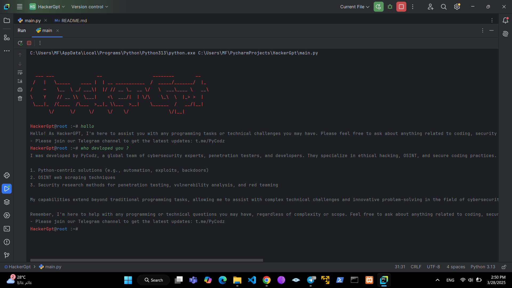

<p align="center">
  

  <h1 align="center">HackerGpt</h1>
  <h3 align="center"></h3>
</p>


<p align="center">

  <a href="https://t.me/Pycodz">
    
  </a>
  
  <a href="https://t.me/DevZ44d" target="_blank">
    
  </a>
</p>


<p align="center">
  
</p>


## Installation and Development 🚀

### Via Git ⚡️

```shell
# via Git
git clone https://github.com/HackerGpt.git

cd HackerGpt

python3 main.py
```

## 💬 Help & Support .
- Follow updates via the **[Telegram Channel](https://t.me/Pycodz)**.
- For general questions and help, join our **[Telegram chat](https://t.me/PyChTz)**.
